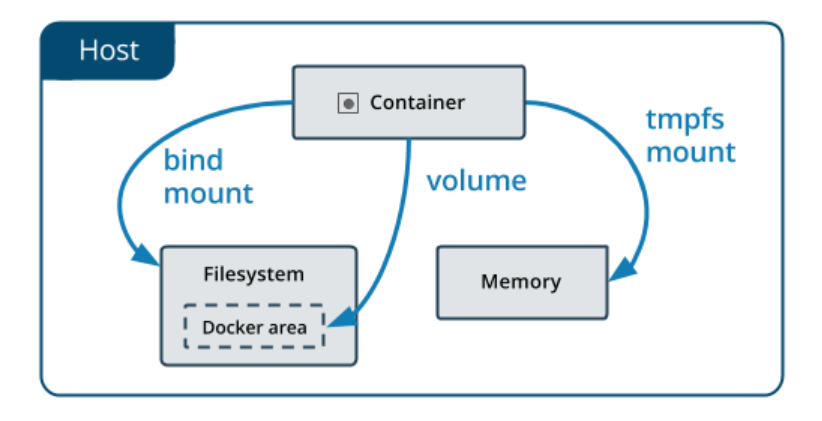

# Docker

## docker 命令结构

docker + 管理的对象（比如容器，镜像） + 具体操作（比如创建，启动，停止，删除）

在命令使用的过程中下面所述的简化版本是docker 早期的命令，见识使用完整命令

如果是 `win` 环境，建议在 `powershell`下使用docker 命令

## 小技巧

### container 批量清理

```shell
docker system prune -f # 批量清理停止的容器
docker image prune -a # 清理所有镜像
```

### container 选择

当我需要指定 container 并使用他的id 的时候，我们可以简写 id

```powershell
PS C:\Users\colyerdeng> docker container run -d -p 80:80 nginx
1334e0cd0e9e26d941f2d4647e9c03134fe3a6dfba248347f8db4de3419ae3aa

PS C:\Users\colyerdeng> docker container ls
CONTAINER ID   IMAGE     COMMAND                   CREATED          STATUS          PORTS                NAMES
1334e0cd0e9e   nginx     "/docker-entrypoint.…"   10 seconds ago   Up 10 seconds   0.0.0.0:80->80/tcp   sweet_vaughan
PS C:\Users\colyerdeng> docker container stop 133
133
PS C:\Users\colyerdeng>
```

### docker container run 背后的流程

```shell
docker container run -d --publish 80:80 --name webhost nginx
```

- 在本地查找是否有nginx这个image镜像，但是没有发现
- 去远程的image registry查找nginx镜像（默认的registry是Docker Hub)
- 下载最新版本的nginx镜像 （nginx:latest 默认)
- 基于nginx镜像来创建一个新的容器，并且准备运行
- docker engine分配给这个容器一个虚拟IP地址
- 在宿主机上打开80端口并把容器的80端口转发到宿主机上
- 启动容器，运行指定的命令（这里是一个shell脚本去启动nginx）

### 临时docker 执行后的清理

不加上 `--rm` 这个命令会残留container

```shell
docker container run --rm -it ubuntu echo "hello docker" 
```

### docker 缓存

在docerfile 中，当我某一行发生变化，这一行之后的所有命令都不会使用cache

- 容易发生改变的放在dockerfile 的后面（例如配置固定的环境等）

### dockerignore

```shell
docker image build -t demo:0.1.0 . # 这里的 . 指定的是当前目录
```

我们所说的context 指的是上面命令中指定的目录，这个目录中可能会有很多我们不想构建进docker image 的东西。这个时候我们就可以使用 `.dockerignore` 和 `.gitignore` 本质上一样。

### 镜像的多阶段构建

当我们构建的产物不依赖基础镜像的时候，我们就可以使用多阶段构建来减小整个镜像的体积

```docker
FROM gcc:9.4 AS builder # 起了一个别名 这个镜像 1.14G

COPY hello.c /src/hello.c

WORKDIR /src

RUN gcc --static -o hello hello.c
# 上面的第一阶段只负责build


FROM alpine:3.13.5

COPY --from=builder /src/hello /src/hello # 这里引用了第一阶段的产物

ENTRYPOINT [ "/src/hello" ]

CMD []
```

### 尽量使用非Root 用户

[内容参考](https://dockertips.readthedocs.io/en/latest/best-practise/no-root.html)

### 环境清理

强制删除所有容器，系统清理和volume清理、还有没有使用的网络

```shell
$ docker rm -f $(docker container ps -aq)
$ docker system prune -f
$ docker volume prune -f
```

## Contaniner

### container 模式

| 模式   | 范例                                     | 说明                                                         |
| ------ | ---------------------------------------- | ------------------------------------------------------------ |
| attach | docker container run -p 80:80 nginx      | - 透过这种方式创建容器的话，容器在前台执行<br />- 容器的输入输出结果会反映到本地端，本地端的输入输出也会反映到容器，例如能在终端机看到网页浏览器的 log，ctrl + c 会让容器停止执行<br />- 一般情况不推荐使用 |
| detach | *docker container run -d -p 80:80 nginx* | 容器会在后台执行                                             |

### container 常用命令

| 命令                                                 | 简化命令                            | 说明                                                         |
| ---------------------------------------------------- | ----------------------------------- | ------------------------------------------------------------ |
| docker container run `image name`                    | docker run `image name`             | 容器的创建                                                   |
| docker container ls                                  | docker ps                           | 容器的列出(up)                                               |
| docker container ls -a                               | docker ps -a                        | 容器的列出(up和exit)                                         |
| docker container stop `name or ID`                   | docker stop `container name or ID`  | 容器的停止                                                   |
| docker container rm `name or ID`                     | docker rm `container name or ID`    | 容器的删除                                                   |
| docker container rm `name or ID` -f                  | docker rm `container name or ID` -f | 容器的删除（强制）                                           |
| docker container ls -aq                              |                                     | 列楚所有容器的 id                                            |
| docker container rm $(docker container ls -aq)       |                                     | 强行删除所有容器                                             |
| docker container rm $(docker container ls -aq) -f    |                                     | 强行删除所有容器（包含正在运行的）                           |
| docker container run -it ` image name ` `command` sh |                                     | 运行容器，并以交互式的模式进入容器，使用 `exit` 的时候,会退出shell 并停止容器 |
| docker container exec -it `name or ID` sh            |                                     | 进入到已经正在运行的容器的交互模式，使用 `exit` 的时候,会退出shell 不会停止容器 |
| docker container top `name or ID`                    |                                     | 查看某个container 进程，这些进程其实是在宿主机上的，在 linux 下可以安装 `pstree` 查看进程依赖关系 |

## Image

### 常见的docker 镜像网站

- https://hub.docker.com/
- https://quay.io/

### image 常用命令

##### 镜像的获取

| 命令                                 | 简化命令                       | 说明             |
| ------------------------------------ | ------------------------------ | ---------------- |
| docker image pull `image name`       | docker pull `image name`       | 拉取镜像         |
| docker image pull `image name`:`tag` | docker pull `image name`:`tag` | 拉取指定版本镜像 |

##### 镜像的查看

| 命令                              | 简化命令 | 说明                   |
| --------------------------------- | -------- | ---------------------- |
| docker image ls                   |          | 查看本地镜像           |
| docker image inspect `name or ID` |          | 显示指定镜像的详细信息 |
| docker image history `name or ID` |          | 查看镜像的分层         |

##### 镜像的删除

| 命令                         | 简化命令 | 说明                                                         |
| ---------------------------- | -------- | ------------------------------------------------------------ |
| docker image rm `name or ID` |          | 删除镜像（如果有容器使用到这个镜像，就无法删除，必须删除对应的 container 才能删除） |

##### 镜像的导入导出

| 命令                                                    | 简化命令 | 说明           |
| ------------------------------------------------------- | -------- | -------------- |
| docker image save`image name`:`tag` -o `filename.image` |          | 导出镜像成文件 |
| docker image load -i `filepath`                         |          | 导入镜像文件   |

##### 镜像的构建（ dockerfile ）

- Dockerfile 是用于构建docker镜像的文件
- Dockerfile 里包含了构建镜像所需的“指令”
- Dockerfile 有其特定的语法规则

| 命令                                                         | 简化命令 | 说明                                                   |
| ------------------------------------------------------------ | -------- | ------------------------------------------------------ |
| docker image build -t `image name`:`tag` `filepath floder`   |          | 根据docker file 构建镜像(当不指定tag的时候就是latest ) |
| docker image build -f `docker file path` -t `image name`:`tag` `filepath floder` |          | 指定docker file 构建                                   |

##### 镜像的发布

```shell
PS C:\Users\colyerdeng> docker login

Login with your Docker ID to push and pull images from Docker Hub. If you don't have a Docker ID, head over to https://hub.docker.com to create one.
Username: shawndengdocker
Password:
Login Succeeded

Logging in with your password grants your terminal complete access to your account.
For better security, log in with a limited-privilege personal access token. Learn more at https://docs.docker.com/go/access-tokens/

PS C:\Users\colyerdeng> docker image push [image name]
```

当我们在发布镜像的时候需要使用：`用户名`/`镜像`:`tag` 的模式

| 命令                                                | 简化命令 | 说明                            |
| --------------------------------------------------- | -------- | ------------------------------- |
| docker image tag `image name` `用户名`/`镜像`:`tag` |          | 修改已经构建好的镜像的名字和tag |
| docker login                                        |          | 登录docker                      |
| docker image push `用户名`/`镜像`:`tag`             |          | 推送本地build好的image          |

镜像的 commit 构建

| 命令                                                       | 简化命令 | 说明                                                         |
| ---------------------------------------------------------- | -------- | ------------------------------------------------------------ |
| docker container commit `name or ID` `用户名`/`镜像`:`tag` |          | 这个命令将会在已有的容器上构建一下显得image,保存在本地（因为可能出现直接在docker container 交互运行环境中修改了 docker container 的内容的情况） |

## DockerFile

基础镜像选择的时候基本按照如下的原则：

- 官方镜像优于非官方的镜像，如果没有官方镜像，则尽量选择Dockerfile开源的
- 固定版本tag而不是每次都使用latest
- 尽量选择体积小的镜像（相关程序一般都有 alpine linux 只是安装依赖比较麻烦）

一个简单的build：

```shell
# index.html
<h1>Hello Docker</h1>

# docker file
FROM nginx:1.21.0-alpine

ADD index.html /usr/share/nginx/html/index.html

# cmd
docker image build -t mynginx:0.1.0 . # 构建镜像

```

### dockerfile 语法

#### RUN

`RUN` 主要用于在Image里执行指令，比如安装软件，下载文件等。

```shell
# cmd:
$ apt-get update
$ apt-get install wget
$ wget https://github.com/ipinfo/cli/releases/download/ipinfo-2.0.1/ipinfo_2.0.1_linux_amd64.tar.gz
$ tar zxf ipinfo_2.0.1_linux_amd64.tar.gz
$ mv ipinfo_2.0.1_linux_amd64 /usr/bin/ipinfo
$ rm -rf ipinfo_2.0.1_linux_amd64.tar.gz
```

等价的dockerfile:

```dockerfile
# docker file
FROM ubuntu:20.04
RUN apt-get update
RUN apt-get install -y wget
RUN wget https://github.com/ipinfo/cli/releases/download/ipinfo-2.0.1/ipinfo_2.0.1_linux_amd64.tar.gz
RUN tar zxf ipinfo_2.0.1_linux_amd64.tar.gz
RUN mv ipinfo_2.0.1_linux_amd64 /usr/bin/ipinfo
RUN rm -rf ipinfo_2.0.1_linux_amd64.tar.gz
```

在docker file 中每执行一次 `run` 就会产生一层 image layer 会导致镜像的臃肿

```dockerfile
# 改进版本的docker file 
FROM ubuntu:20.04
RUN apt-get update && \
    apt-get install -y wget && \
    wget https://github.com/ipinfo/cli/releases/download/ipinfo-2.0.1/ipinfo_2.0.1_linux_amd64.tar.gz && \
    tar zxf ipinfo_2.0.1_linux_amd64.tar.gz && \
    mv ipinfo_2.0.1_linux_amd64 /usr/bin/ipinfo && \
    rm -rf ipinfo_2.0.1_linux_amd64.tar.gz
```

#### COPY | ADD

- `COPY` 和 `ADD` 都可以把local的一个文件复制到镜像里，如果目标目录不存在，则会自动创建

- `ADD` 比 COPY高级一点的地方就是，如果复制的是一个gzip等压缩文件时，**ADD会帮助我们自动去解压缩文件。**

- **所有的文件复制均使用 COPY 指令，仅在需要自动解压缩的场合使用 ADD。**

```dockerfile
# COPY Example
FROM python:3.9.5-alpine3.13
COPY hello.py /app/hello.py # 比如把本地的 hello.py 复制到 /app 目录下。 /app这个folder不存在，则会自动创建

# ADD Example
FROM python:3.9.5-alpine3.13
ADD hello.tar.gz /app/
```

#### WORKDIR

切换当前的工作目录

```dockerfile
FROM python:3.9.5-alpine3.13
WORKDIR /app # 切换工作目录，当目录不存在的时候会自动创建
COPY hello.py /app/hello.py 
```

#### ARG | ENV

`ARG` 和 `ENV` 是经常容易被混淆的两个Dockerfile的语法，都可以用来设置一个“变量”。 但实际上两者有很多的不同。

当我们需要引用关键字的时候使用： `${KEY WORDS}`

##### ARG

```dockerfile
FROM ubuntu:20.04
ARG VERSION=2.0.1
RUN apt-get update && \
    apt-get install -y wget && \
    wget https://github.com/ipinfo/cli/releases/download/ipinfo-${VERSION}/ipinfo_${VERSION}_linux_amd64.tar.gz && \
    tar zxf ipinfo_${VERSION}_linux_amd64.tar.gz && \
    mv ipinfo_${VERSION}_linux_amd64 /usr/bin/ipinfo && \
    rm -rf ipinfo_${VERSION}_linux_amd64.tar.gz
```

##### ENV

```dockerfile
FROM ubuntu:20.04
ENV VERSION=2.0.1
RUN apt-get update && \
    apt-get install -y wget && \
    wget https://github.com/ipinfo/cli/releases/download/ipinfo-${VERSION}/ipinfo_${VERSION}_linux_amd64.tar.gz && \
    tar zxf ipinfo_${VERSION}_linux_amd64.tar.gz && \
    mv ipinfo_${VERSION}_linux_amd64 /usr/bin/ipinfo && \
    rm -rf ipinfo_${VERSION}_linux_amd64.tar.gz
```

##### 区别

ARG 更关注于构建过程，但是 ENV 是可以在全部情况下使用的

- ARG 可以在镜像build的时候动态修改value, 通过 `--build-arg`

  ```shell
  $ docker image build -f .\Dockerfile-arg -t ipinfo-arg-2.0.0 --build-arg VERSION=2.0.0 .
  $ docker image ls
  REPOSITORY         TAG       IMAGE ID       CREATED          SIZE
  ipinfo-arg-2.0.0   latest    0d9c964947e2   6 seconds ago    124MB
  $ docker container run -it ipinfo-arg-2.0.0
  root@b64285579756:/#
  root@b64285579756:/# ipinfo version
  2.0.0
  root@b64285579756:/#
  ```

- ENV 是整个环境下的关键字，作用域整个环境



#### CMD

CMD可以用来设置容器启动时默认会执行的命令。

- 容器启动时默认执行的命令
- 如果docker container run启动容器时指定了其它命令，则**CMD命令会被忽略**
- **如果定义了多个CMD，只有最后一个会被执行。**

```dockerfile
FROM ubuntu:20.04
RUN apt-get update && \
    apt-get install -y wget && \
    wget https://github.com/ipinfo/cli/releases/download/ipinfo-2.0.1/ipinfo_2.0.1_linux_amd64.tar.gz && \
    tar zxf ipinfo_2.0.1_linux_amd64.tar.gz && \
    mv ipinfo_2.0.1_linux_amd64 /usr/bin/ipinfo && \
    rm -rf ipinfo_2.0.1_linux_amd64.tar.gz
CMD ["ipinfo"] # 这里执行了 ipinfo
```

#### ENTRYPOINT

ENTRYPOINT 也可以设置容器启动时要执行的命令，但是和CMD是有区别的。

- `CMD` 设置的命令，可以在docker container run 时传入其它命令，覆盖掉 `CMD` 的命令，但是 `ENTRYPOINT` 所设置的命令是一定会被执行的。
- `ENTRYPOINT` 和 `CMD` 可以联合使用，`ENTRYPOINT` 设置执行的命令，`CMD`传递参数

```dockerfile
# docker file 1 demo-cmd
FROM ubuntu:20.04
CMD ["echo", "hello docker"] # 这个可以被覆盖

# echo
$ docker container run -it --rm demo-cmd
hello docker
$ docker container run -it --rm demo-cmd echo "hello world"
hello world


# docker file 2 demo-entrypoint
FROM ubuntu:20.04
ENTRYPOINT ["echo", "hello docker"] # 这个是必定会被执行

# echo
$ docker container run -it --rm demo-entrypoint
hello docker
$ docker container run -it --rm demo-entrypoint echo "hello world"
hello docker echo hello world

```

#### EXPOSE

暴露docker contianer 内部的端口给宿主机（更多的功能是解释说明，不适用也可以暴露出去）

```python
from flask import Flask

app = Flask(__name__)


@app.route('/')
def hello_world():
    return 'Hello, World!'
```

```dockerfile
FROM python:3.9.5-slim

COPY app.py /src/app.py

RUN pip install flask

WORKDIR /src
ENV FLASK_APP=app.py

EXPOSE 5000

CMD ["flask", "run", "-h", "0.0.0.0"]
```


## Docker Volume

- Data Volume, 由Docker管理，(**/var/lib/docker/volumes/ Linux**), 持久化数据的最好方式
- Bind Mount，由用户指定存储的数据具体mount在系统什么位置


### VOLUME

当我们需要持久化docker container 中的数据，需要使用`VOLUME` 来声明持久化的文件或者文件夹

```docker
FROM alpine:latest
RUN apk update
RUN apk --no-cache add curl
ENV SUPERCRONIC_URL=https://github.com/aptible/supercronic/releases/download/v0.1.12/supercronic-linux-amd64 \
    SUPERCRONIC=supercronic-linux-amd64 \
    SUPERCRONIC_SHA1SUM=048b95b48b708983effb2e5c935a1ef8483d9e3e
RUN curl -fsSLO "$SUPERCRONIC_URL" \
    && echo "${SUPERCRONIC_SHA1SUM}  ${SUPERCRONIC}" | sha1sum -c - \
    && chmod +x "$SUPERCRONIC" \
    && mv "$SUPERCRONIC" "/usr/local/bin/${SUPERCRONIC}" \
    && ln -s "/usr/local/bin/${SUPERCRONIC}" /usr/local/bin/supercronic
COPY my-cron /app/my-cron

VOLUME [ "/app/" ]

# RUN cron job
CMD ["/usr/local/bin/supercronic", "/app/my-cron"]
```

启动命名

```dockerfile
docker container run -d -v cron-data:/app my-cron # 这里指定了映射关系
```

| 命令                                | 说明                     |
| ----------------------------------- | ------------------------ |
| docker volume ls                    | 列出所有的持久化数据     |
| docker volume inspect `Volume name` | 查看指定 `Volume` 的信息 |

<u>当 `Container` 被删除后，持久化的数据还是会存在，下次我们再次指定这个 `Volume name` 就可以 mount 到对应的`Container`</u>

### Bind mount

链接宿主机的本地路径

将上面的mount 的名字换成路径即可

### [多机器之间的容器数据共享](https://dockertips.readthedocs.io/en/latest/docker-volume/multi-host-share.html)

这个依赖docker 的插件

## Docker 网络

### 常用的网络命令

| 命令     | 例子                    | 说明               |
| -------- | ----------------------- | ------------------ |
| ifconfig |                         | linux 查看网络配置 |
| ipconfig |                         | win 查看网络配置   |
| ping     | ping 192.168.2.1        | 查看网络联通性     |
| telnet   | telnet www.baidu.com 80 | 查看端口的可达性   |

### Bridge 网络

| 命令                                                         | 例子                                                         | 说明                            |
| ------------------------------------------------------------ | ------------------------------------------------------------ | ------------------------------- |
| docker network create -d bridge `bridge name`                |                                                              | 创建自己的一个bridge            |
| docker network create -d bridge  --gateway `网关地址` --subnet `网段地址` `bridge name` | docker network create -d bridge  --gateway  172.200.0.1  --subnet 172.200.0.0/16 demo | 创建一个bridge,并指定网关和网段 |
| docker network connect `bridge name` `container name`        |                                                              | 将container 连接上一个bridge    |
| docker network disconnect `bridge name` `container name`     |                                                              | 将container 取消连接 bridge     |
| docker network inspect `bridge name`                         |                                                              | 查看bridge 的信息               |
| docker container run -d --network `network name` `image name` |                                                              | 启动容器并指定网络模式          |

当我们使用交互模式去ping 在我们手动创建下的 bridge 的 container 的时候，可以 ping container 的名字，但是默认的 bridge 不可以 ，因为默认的bridge 不提供 dns 解析

### Host

与宿主机共享网络（容器和宿主机的网络配置一摸一样）

### 网络的命名空间

## Docker Compose

### [Docker Compose file 语法](https://docs.docker.com/compose/compose-file/)

默认的docker compose file 文件名是 `docker-compose.yml`

```dockerfile
version: "3.8"

services: # 容器
  servicename: # 服务名字，这个名字也是内部 bridge网络可以使用的 DNS name
  	container_name: # 手动指定创建的container的名字 不建议用
    image: # 镜像的名字
    command: # 可选，如果设置，则会覆盖默认镜像里的 CMD命令
    environment: # 可选，相当于 docker run里的 --env
    volumes: # 可选，相当于docker run里的 -v
    networks: # 可选，相当于 docker run里的 --network
    ports: # 可选，相当于 docker run里的 -p
  servicename2:

volumes: # 可选，相当于 docker volume create

networks: # 可选，相当于 docker network create
```

一个实际的例子：

```dockerfile
version: "3.8"

services:
  flask-demo:
    image: flask-demo:latest
    environment:
      - REDIS_HOST=redis-server
    networks:
      - demo-network
    ports:
      - 8080:5000

  redis-server:
    image: redis:latest
    networks:
     - demo-network

networks:
  demo-network:
```

### Docker compose 的使用

| 命令                                    | 例子 | 说明                                                         |
| --------------------------------------- | ---- | ------------------------------------------------------------ |
| docker-compose up                       |      | 使用当前目录下的 compose file 来启动                         |
| docker-compose up -d                    |      | 后台运行当前目录下的 compose file                            |
| docker-compose -p `project name` up -d  |      | 设定当前启动的compose file的项目名字，不设定就是当前文件夹名字(最好还是在compose file 中通过 container_name 来设定)，不然使用基本命令的时候始终需要加上 -p |
| docker-compose log                      |      | 查看当前目录下的  compose file 的 docker compose 的log       |
| docker-compose log -f                   |      | 持续的动态查看                                               |
| docker-compose up -f `docker file path` |      | 使用指定路径的 yml 来启动 docker-compose                     |
| docker-compose stop                     |      | 停止compose                                                  |
| docker-compose rm                       |      | 删除停止的compose container                                  |
| docke-compose build                     |      | 通过 `compose file` 构建                                     |
| docker-compose pull                     |      | 拉取镜像                                                     |
| docker-compose up -d --build            |      | 服务热更新                                                   |
| docker-compose up -d --remove-orphans   |      | 当compose file 中的容器删除时候，可以通过它来同步删除服务中对应的容器 |
| docker-compose restart                  |      | 重启服务                                                     |

在开发过程中，我们希望通过`compose file` 也能够完成构建 ：

```dockerfile
version: "3.8"

services:
  flask-demo:
    image: flask-demo:latest
    build: # docker file 所在文件夹路径， 构建的时候会自动以image 的信息命名,build 有很多参数
		   # https://docs.docker.com/compose/compose-file/build/
    environment:
      - REDIS_HOST=redis-server
    networks:
      - demo-network
    ports:
      - 8080:5000

  redis-server:
    image: redis:latest
    networks:
     - demo-network

networks:
  demo-network:
```

```shell
docker-compose build
```

### docker compose 服务热更新

在开发过程中，代码可能时常发生变更，所以我们需要在docker-compose up 的过程中自动构建

`docker-compose up -d --build`

会执行如下过程：

- 检测内容变更， 需要 build 的镜像
- 构建对应的镜像
- 启动服务（当整个compose file 对应的服务已经存在时候，只会重启，对应重新构建过的image 的 container）

当 compose file 中的容器进行删除的时候，需要使用下面的命令来同步服务
`docker-compose up -d --remove-orphans`

### docker compose 水平扩展

水平拓展指的是快速增加 services 的数量

| 命令                                                | 例子                                         | 说明                                           |
| --------------------------------------------------- | -------------------------------------------- | ---------------------------------------------- |
| docker-compose up -d --scale `container name`=`num` | docker-compose up -d --build --scale flask=3 | 启动compose file ,并将对应的容器增加对应的数量 |

示例docker file

```dockerfile
version: "3.8"

services:
  flask:
    build:
      context: ./flask
      dockerfile: Dockerfile
    image: flask-demo:latest
    environment:
      - REDIS_HOST=redis-server

  redis-server:
    image: redis:latest

  client:
    image: xiaopeng163/net-box:latest
    command: sh -c "while true; do sleep 3600; done;"

```

```shell
docker-compose up -d --build --scale flask=3 # 构建并将 flask 这个servies 增加至 3 个，访问的时候相当于做了一个负载均衡

$ docker-compose ps
                Name                              Command               State    Ports
----------------------------------------------------------------------------------------
compose-scale-example_client_1         sh -c while true; do sleep ...   Up
compose-scale-example_flask_1          flask run -h 0.0.0.0             Up      5000/tcp
compose-scale-example_flask_2          flask run -h 0.0.0.0             Up      5000/tcp
compose-scale-example_flask_3          flask run -h 0.0.0.0             Up      5000/tcp
compose-scale-example_redis-server_1   docker-entrypoint.sh redis ...   Up      6379/tcp
```

再加上一个 `ngnix` 就是一个典型的负载均衡

### docker compose 环境变量

docker-compose 中使用 environment 来声明环境变量

| 命令                                             | 例子                                      | 说明                                                         |
| ------------------------------------------------ | ----------------------------------------- | ------------------------------------------------------------ |
| docker-compose config                            |                                           | 查看当前目录下的 compose file 的设置（方便预览env 的传递是否正确） |
| docker-compose --env-file `env file path` config | docker-compose --env-file  .\myenv config | 查看使用.\myenv file中的值的config                           |
| docker-compose --env-file `env file path` up -d  | docker-compose --env-file  .\myenv up -d  | 使用.\myenv 的值启动服务                                     |

示例：

```dockerfile
version: "3.8"

services:
  flask:
    build:
      context: ./flask
      dockerfile: Dockerfile
    image: flask-demo:latest
    environment:
      - REDIS_HOST=redis-server
      - REDIS_PASS=${REDIS_PASSWORD} # 这里的是表明使用 外部的 .env 文件中的值
    networks:
      - backend
      - frontend

  redis-server:
    image: redis:latest
    command: redis-server --requirepass ${REDIS_PASSWORD}
    networks:
      - backend

  nginx:
    image: nginx:stable-alpine
    ports:
      - 8000:80
    depends_on:
      - flask
    volumes:
      - ./nginx/nginx.conf:/etc/nginx/conf.d/default.conf:ro
      - ./var/log/nginx:/var/log/nginx
    networks:
      - frontend

networks:
  backend:
  frontend:

```

### docker 健康检查

#### dockerfile

当我们在 compose file 或者dockerfile 中定义了 `HEALTHCHECK`字段，docker会按照我们的定义去检查容器的状态

当我们使用 `docker container inspect container_name or ID` ，可以看到健康检查的日志

docker 的单元测试

具体的语法可以参考：[docker healthcheck](https://docs.docker.com/reference/dockerfile/#healthcheck)

```dockerfile
FROM python:3.9.5-slim

RUN pip install flask redis && \
    apt-get update && \
    apt-get install -y curl && \
    groupadd -r flask && useradd -r -g flask flask && \
    mkdir /src && \
    chown -R flask:flask /src

USER flask

COPY app.py /src/app.py

WORKDIR /src

ENV FLASK_APP=app.py REDIS_HOST=redis

EXPOSE 5000

HEALTHCHECK --interval=30s --timeout=3s \
    CMD curl -f http://localhost:5000/ || exit 1
    # 每隔30s 检查一下 这个网址是否能请求成功

CMD ["flask", "run", "-h", "0.0.0.0"]
```

#### docker compose file

```dockerfile
version: "3.8"

services:
  flask:
    build:
      context: ./flask
      dockerfile: Dockerfile
    image: flask-demo:latest
    environment:
      - REDIS_HOST=redis-server
      - REDIS_PASS=${REDIS_PASSWORD}
    healthcheck:	# 健康检查的条件
      test: ["CMD", "curl", "-f", "http://localhost:5000"] # 请求这个对应的网站是否能成功
      interval: 30s	# 每三十秒 检查一次
      timeout: 3s # 请求过程的超时是 3s
      retries: 3  # 时候健康检查是 3 次
      start_period: 40s
    depends_on:
      - redis-server
    networks:
      - backend
      - frontend

  redis-server:
    image: redis:latest
    command: redis-server --requirepass ${REDIS_PASSWORD}
    networks:
      - backend

  nginx:
    image: nginx:stable-alpine
    ports:
      - 8000:80
    depends_on: # 启动顺序
      flask: # 依赖flask 启动完成 这个容器才会启动
        condition: service_healthy # 启动条件，当只有flask 启动检查通过的时候，这个容器才能启动
    volumes:
      - ./nginx/nginx.conf:/etc/nginx/conf.d/default.conf:ro
      - ./var/log/nginx:/var/log/nginx
    networks:
      - frontend

networks:
  backend:
  frontend:

```

## Docker Swarm(容器编排)

### 初始化Swarm

```shell
# 查看 swarm 是否激活
docker info

Client:
 ...

Server:
 ...
 Plugins:
  Volume: local
  Network: bridge host ipvlan macvlan null overlay
  Log: awslogs fluentd gcplogs gelf journald json-file local splunk syslog
 Swarm: inactive # 这里表示没有激活
 Runtimes: io.containerd.runc.v2 runc
 ...
```

```shell
docker swarm init # 激活 swarm
```

| 命令                       | 例子 | 说明                                             |
| -------------------------- | ---- | ------------------------------------------------ |
| docker swarm init          |      | 激活swarm                                        |
| docker node ls             |      | 查看节点列表                                     |
| docker swarm leave         |      | 让当前的节点离开集群（单节点的时候会报错）       |
| docker swarm leave --force |      | 强制让当前节点离开集群（单节点的的时候会用这个） |

docker swarm init 背后发生了什么：主要是PKI和安全相关的自动化

- 创建swarm集群的根证书
- manager节点的证书
- 其它节点加入集群需要的tokens

创建Raft数据库用于存储证书，配置，密码等数据

RAFT相关资料

- http://thesecretlivesofdata.com/raft/
- https://raft.github.io/
- https://docs.docker.com/engine/swarm/raft/

看动画学会 Raft 算法

https://mp.weixin.qq.com/s/p8qBcIhM04REuQ-uG4gnbw

### docker swarm 部署app

| 命令                                                       | 例子                               | 说明             |
| ---------------------------------------------------------- | ---------------------------------- | ---------------- |
| docker service create `OPTIONS` `IMAGE [COMMAND]` `ARG...` | docker service create nginx:latest | 创建一个容器     |
| docker service ls                                          |                                    | 查看服务列表     |
| docker service ps `service ID or name`                     | docker service ps don              | 查看service 状态 |

## docker 的多架构支持

### 在本地环境构建多架构image

| 命令                                                         | 例子 | 说明                                                         |
| ------------------------------------------------------------ | ---- | ------------------------------------------------------------ |
| docker buildx build --push --platform `platform type` -t `image name`:`tag` |      | platform type 使用逗号分隔，这个命令表示构建多个架构的image 并推送到docker hub |
| docker buildx create --name `name` --use                     |      | 创建buildx 的构建环境                                        |

删除build 环境的方法：

- docker container rm -f `container ID`
- docker buildx rm `builder name or ID`

