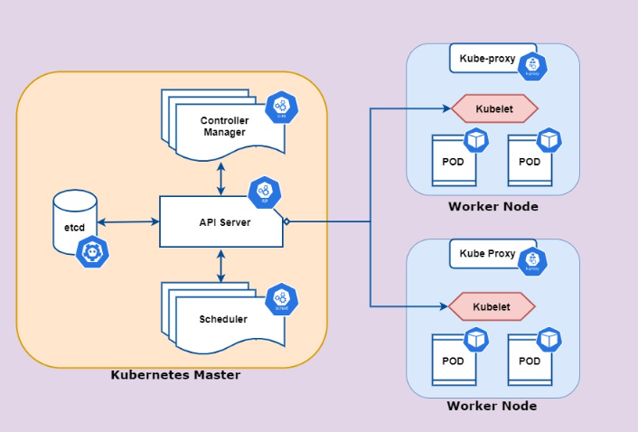
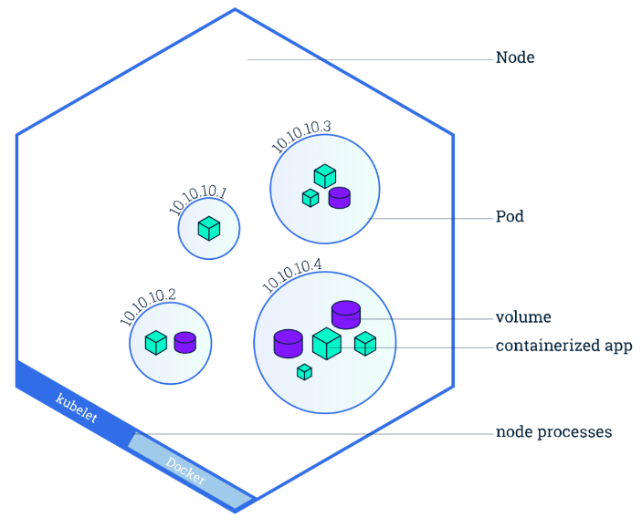
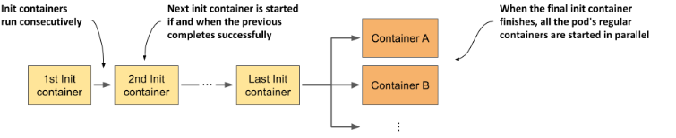
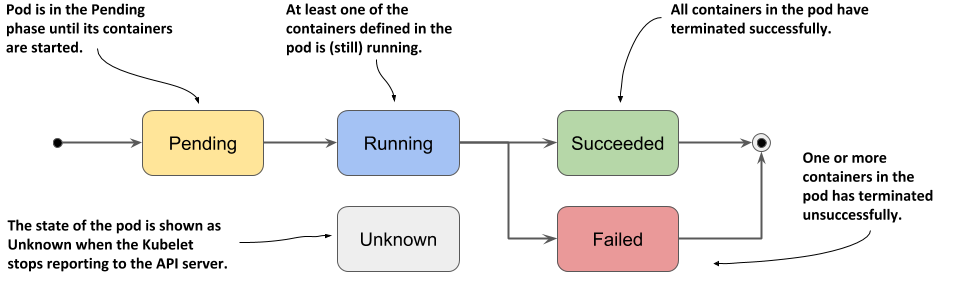
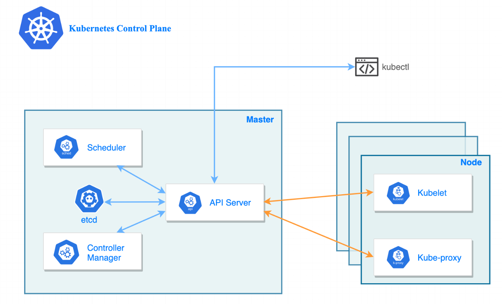

# K8S 基础入门

## 常用命令

### Kubectl 常用命令

| 命令 | 说明 |
| --- | --- |
| `kubectl get node` | 查看当前的 node 状态 |
| `kubectl get pod -A` | 查看所有的 pod 状态 |
| `kubectl get pod -A -o wide` | 查看所有pod 的状态的详细信息（可以看到在那个机器上） |
| `source <(kubectl completion bash)` | kubectl 命令自动补全 |
| `kubectl expose pod [pod name] --port 8000` | 暴露80的端口到8000 |
| `kubectl get services` | 列出所有的服务 |
| `kubectl delete service [services name]` | 删除服务 |
| `kubectl explain [命令]` | 查询命令的文档 |
| `kubectl apply -f [yaml]` | 通过yaml 创建相关资源 |
| `kubectl config get-contexts` | 获取k8s 集群的上下文 |
| `kubectl config set-context --current --namespace=[namespace]` | 设置默认的 namespace |

### kubeadm 常用命令

| 命令 | 说明 |
| --- | --- |
| `kubeadm token list` | 获取加入集群的 token |
| `openssl x509 -in /etc/kubernetes/pki/ca.crt -pubkey -noout \| openssl pkey -pubin -outform DER \| openssl dgst -sha256` | 获取加入集群的 discovery-token-ca-cert-hash |

### Vagrant 常用命令

| 命令 | 说明 |
| --- | --- |
| `vagrant box list` | 查看目前已有的box |
| `vagrant box add` | 新增加一个box |
| `vagrant box remove` | 删除指定的box |
| `vagrant init` | 初始化配置vagrantfile |
| `vagrant up` | 启动虚拟机 |
| `vagrant ssh [pc name]` | ssh登录虚拟机 |
| `vagrant suspend` | 挂起虚拟机 |
| `vagrant reload` | 重启虚拟机 |
| `vagrant halt` | 关闭虚拟机 |
| `vagrant status` | 查看虚拟机状态 |
| `vagrant destroy` | 删除虚拟机 |

## 环境配置

当我们需要一个简单的 K8S 集群, 需要使用如下工具

- `kubeadm` k8s 管理工具
- `vagrant` 虚拟机管理器
- `VirtualBox` 虚拟化driver

### 创建虚拟机

```shell
$ git clone https://github.com/xiaopeng163/learn-k8s-from-scratch
$ cd learn-k8s-from-scratch/lab/kubeadm-3-nodes
$ vagrant up

$ vagrant status
# Current machine states:

# k8s-master                running (virtualbox)
# k8s-worker1               running (virtualbox)
# k8s-worker2               running (virtualbox)

# This environment represents multiple VMs. The VMs are all listed
# above with their current state. For more information about a specific
# VM, run `vagrant status NAME`.
```

### master 初始化

#### 拉取镜像

```shell
$ vagrant ssh [machine name]

# 拉取镜像 可做可不做
$ sudo kubeadm config images pull
# I0601 05:57:31.644809    4849 version.go:256] remote version is much newer: v1.30.1; falling back to: # stable-1.29
# [config/images] Pulled registry.k8s.io/kube-apiserver:v1.29.5
# [config/images] Pulled registry.k8s.io/kube-controller-manager:v1.29.5
# [config/images] Pulled registry.k8s.io/kube-scheduler:v1.29.5
# [config/images] Pulled registry.k8s.io/kube-proxy:v1.29.5
# [config/images] Pulled registry.k8s.io/coredns/coredns:v1.11.1
# [config/images] Pulled registry.k8s.io/pause:3.9
# [config/images] Pulled registry.k8s.io/etcd:3.5.10-0
```

#### 初始化 Kebeadm

- `--apiserver-advertise-address` 这个地址是本地用于和其他节点通信的IP地址（master 的ip）
- `--pod-network-cidr` pod network 地址空间(不要跟本地的地址空间有冲突)
- 初始化, 成功后会给出需要继续执行的代码

  ```shell
  $ sudo kubeadm init --apiserver-advertise-address=192.168.56.10  --pod-network-cidr=10.244.0.0/16
  
  # Your Kubernetes control-plane has initialized successfully!
  
  # To start using your cluster, you need to run the following as a regular user:
  
  #  mkdir -p $HOME/.kube
  #  sudo cp -i /etc/kubernetes/admin.conf $HOME/.kube/config
  #  sudo chown $(id -u):$(id -g) $HOME/.kube/config
  
  # Alternatively, if you are the root user, you can run:
  
  #  export KUBECONFIG=/etc/kubernetes/admin.conf
  
  # You should now deploy a pod network to the cluster.
  # Run "kubectl apply -f [podnetwork].yaml" with one of the options listed at:
  #  https://kubernetes.io/docs/concepts/cluster-administration/addons/
  
  # Then you can join any number of worker nodes by running the following on each as root:
  
  # kubeadm join 192.168.56.10:6443 --token 3twkp1.92vffsjjkuwg6mi9 \
  #        --discovery-token-ca-cert-hash sha256:8b506bd765bc638bff50e8c773be575f54beba3fccbe9e9b4f2e0a4ad4cd598a
  ```
- 保存 `.kube` 配置：

  ```shell
  # 保存一些基本的配置给 kubectl
  mkdir -p $HOME/.kube
  sudo cp -i /etc/kubernetes/admin.conf $HOME/.kube/config
  sudo chown $(id -u):$(id -g) $HOME/.kube/config
  
  # 检查状态：
  kubectl get nodes
  kubectl get pods -A
  ```
- 部署 Pod network 方案, 这里我们选择 [flannel](https://raw.githubusercontent.com/flannel-io/flannel/v0.24.2/Documentation/kube-flannel.yml)
  在 kube-flannel的容器args里，确保有iface=enp0s8, 其中enp0s8是我们的–apiserver-advertise-address=192.168.56.10 接口名

  ```yaml
  # flannel 配置里我们需要设置 Network 地址，需要与 --pod-network-cidr 地址一致
    net-conf.json: |
      {
        "Network": "10.244.0.0/16",
        "Backend": {
          "Type": "vxlan"
        }
      }
  # ...
  
  - name: kube-flannel
    image: docker.io/flannel/flannel:v0.24.2
    command:
    - /opt/bin/flanneld
    args:
    - --ip-masq
    - --kube-subnet-mgr
    - --iface=enp0s8 # 这里与 ip a 命令查看的接口名一样 
  ```

  应用网络方案配置
  ```shell
  vagrant@k8s-master:~$ kubectl apply -f flannel.yml
  # namespace/kube-flannel created
  # clusterrole.rbac.authorization.k8s.io/flannel created
  # clusterrolebinding.rbac.authorization.k8s.io/flannel created
  # serviceaccount/flannel created
  # configmap/kube-flannel-cfg created
  # daemonset.apps/kube-flannel-ds created
  
  # 此时 node 的状态应该发生了改变
  vagrant@k8s-master:~$ kubectl get node
  # NAME         STATUS   ROLES           AGE   VERSION
  # k8s-master   Ready    control-plane   38m   v1.29.2
  ```

  ### 增加集群 Worker

  此时master 节点和 worker 还不在一个集群中：
  ```shell
  vagrant@k8s-master:~$ kubectl get node
  # NAME         STATUS   ROLES           AGE   VERSION
  # k8s-master   Ready    control-plane   38m   v1.29.2
  ```

  初始化完成的时候，kubeadm 给了我们一个命令行，用来增加 worker，需要在 worker 中去执行这个命令，使 worker 加入集群

  ```shell
  vagrant@k8s-worker1:~$ sudo kubeadm join 192.168.56.10:6443 --token 3twkp1.92vffsjjkuwg6mi9 --discovery-token-ca-cert-hash sha256:8b506bd765bc638bff50e8c773be575f54beba3fccbe9e9b4f2e0a4ad4cd598a
  
  # [preflight] Running pre-flight checks
  # [preflight] Reading configuration from the cluster...
  # [preflight] FYI: You can look at this config file with 'kubectl -n kube-system get cm kubeadm-config -o yaml'
  # [kubelet-start] Writing kubelet configuration to file "/var/lib/kubelet/config.yaml"
  # [kubelet-start] Writing kubelet environment file with flags to file "/var/lib/kubelet/kubeadm-flags.env"
  # [kubelet-start] Starting the kubelet
  # [kubelet-start] Waiting for the kubelet to perform the TLS Bootstrap...
  
  # This node has joined the cluster:
  # * Certificate signing request was sent to apiserver and a response was received.
  # * The Kubelet was informed of the new secure connection details.
  
  # Run 'kubectl get nodes' on the control-plane to see this node join the cluster.
  
  vagrant@k8s-master:~$ kubectl get node
  # NAME          STATUS   ROLES           AGE   VERSION
  # k8s-master    Ready    control-plane   50m   v1.29.2
  # k8s-worker1   Ready    <none>          77s   v1.29.2
  ```

### INTERNAL-IP 问题

当使用 `vagrant` 创建的集群时候，node 的 `INTERNAL-IP` 是完全一样的

```shell
vagrant@k8s-master:~$ kubectl get node -o wide
# NAME          STATUS   ROLES           AGE    VERSION   INTERNAL-IP   EXTERNAL-IP   OS-IMAGE             KERNEL-VERSION      CONTAINER-RUNTIME
# k8s-master    Ready    control-plane   138m   v1.29.2   10.0.2.15     <none>        Ubuntu 20.04.6 LTS   5.4.0-182-generic   containerd://1.6.32
# k8s-worker1   Ready    <none>          88m    v1.29.2   10.0.2.15     <none>        Ubuntu 20.04.6 LTS   5.4.0-182-generic   containerd://1.6.32
# k8s-worker2   Ready    <none>          85m    v1.29.2   10.0.2.15     <none>        Ubuntu 20.04.6 LTS   5.4.0-182-generic   containerd://1.6.32
```

编辑 kubeadm 配置文件

```shell
vagrant@k8s-master:~$ sudo vim /var/lib/kubelet/kubeadm-flags.env
# KUBELET_KUBEADM_ARGS="--container-runtime-endpoint=unix:///var/run/containerd/containerd.sock --pod-# infra-container-image=registry.k8s.io/pause:3.9"
#KUBELET_EXTRA_ARGS="--node-ip=192.168.56.10" 新增这一行
```

重启服务

```shell
vagrant@k8s-master:~$ sudo systemctl daemon-reload
vagrant@k8s-master:~$ sudo systemctl restart kubelet
vagrant@k8s-master:~$ kubectl get node -o wide
# NAME          STATUS   ROLES           AGE    VERSION   INTERNAL-IP     EXTERNAL-IP   OS-IMAGE             KERNEL-VERSION      CONTAINER-RUNTIME
# k8s-master    Ready    control-plane   146m   v1.29.2   192.168.56.10   <none>        Ubuntu 20.04.6 LTS   5.4.0-182-generic   containerd://1.6.32
# k8s-worker1   Ready    <none>          97m    v1.29.2   10.0.2.15       <none>        Ubuntu 20.04.6 LTS   5.4.0-182-generic   containerd://1.6.32
# k8s-worker2   Ready    <none>          94m    v1.29.2   10.0.2.15       <none>        Ubuntu 20.04.6 LTS   5.4.0-182-generic   containerd://1.6.32
```

此时可以看到 master 节点已经修改过来了。

所有的work 都需要这样子修改，但是 ip 是不同的

## K8S API Server



### Pod

- 一组一个或多个应用程序容器及其共享资源（例如卷）
- Pod 共享与网络名称空间相同的名称空间（具有相同的 IP 地址。）
- Pod是k8s里最小的调度单位。



#### 通过命令行创建Pod

| 命令                                                         | 例子                                                         | 说明                                          |
| ------------------------------------------------------------ | ------------------------------------------------------------ | --------------------------------------------- |
| kubectl run [ pod name ] --image=[ image name ]              | kubectl run web --image=nginx                                | 在k8s上用nginx的image创建一个pod              |
| kubectl run [pod name] –image=[ image name] --command -- [ cmd ] [ arg1 ] … [ argN ] | $ kubectl run client --image=busybox --command -- bin/sh -c "sleep 100000" | 在k8s上用busybox 的image创建一个pod并执行命令 |
|                                                              |                                                              |                                               |

#### yaml 声明式创建

以下yaml文件是定义一个pod所需的最少字段 (nginx.yml)

```yaml
apiVersion: v1
kind: Pod
metadata:
  name: web
spec:
   containers:
    - name: nginx-container
      image: nginx:latest
```

运行一个命令, sh -c “sleep 1000000”

```yaml
apiVersion: v1
kind: Pod
metadata:
   name: client
spec:
   containers:
    - name: client
      image: busybox
      command: #定义一个需要运行的命令
       - sh
       - -c
       - "sleep 1000000"
```

多个`Container` Pod

```yaml
apiVersion: v1
kind: Pod
metadata:
   name: my-pod
spec:
   containers:
    - name: nginx
      image: nginx
    - name: client
      image: busybox
      command:
       - sh
       - -c
       - "sleep 1000000"
```

#### 模拟创建

##### Server-side

和正常情况一样处理客户端发送过来的请求，但是并不会把Object状态持久化存储到storage中

```shell
$ kubectl apply -f nginx.yml --dry-run=server
```

##### Client-side

- 把要操作的Object通过标准输出stdout输出到terminal
- 验证manifest的语法
- 可以用于生成语法正确的Yaml manifest

```SHELL
$ kubectl apply -f nginx.yml --dry-run=client
$ kubectl run web --image=nginx --dry-run=client -o yaml
$ kubectl run web --image=nginx --dry-run=client -o yaml > nginx.yml
```

#### Pod 的基本操作

| 命令                                                         | 说明                                     |
| ------------------------------------------------------------ | ---------------------------------------- |
| kubectl get pods                                             | 获取 `pod` 列表                          |
| kubectl get pods -o wide --show-labels                       | 获取 `pod` 的列表的详细信息，并显示label |
| kubectl get pod [ pod name ] -o wide                         | 获取指定 `pod` 的信息                    |
| kubectl get pod -o wide                                      | 获取`pod`的详细信息                      |
| kubectl get pod [ pod name ] -o wide                         | 获取指定`pod`的详细信息                  |
| kubectl describe pod [ pod name ]                            | 获取指定 `pod` 的详细信息                |
| kubectl delete pod  [ pod name ]                             | 删除指定的 `pod`                         |
| kubectl apply -f [ pod yaml ]                                | 通过 `yaml` 创建 `pod`                   |
| kubectl run [ pod name ]--image=[ image name ] --namespace=[ namespace ] | 创建pod 到指定的命名空间                 |

```shell
vagrant@k8s-master:~$ kubectl describe pod web1
Name:             web1
Namespace:        default
Priority:         0
Service Account:  default
Node:             k8s-worker2/192.168.56.12
Start Time:       Mon, 08 Jul 2024 15:41:25 +0000
Labels:           run=web1
Annotations:      <none>
Status:           Running
IP:               10.244.2.2
IPs:
  IP:  10.244.2.2
Containers:
  web1:
    Container ID:   containerd://2d7fba804ae7f6d1dad93ae71d0ee0ebb1afe5c7fbc4280405fb7f779a4a3ae3
    Image:          nginx
    Image ID:       docker.io/library/nginx@sha256:67682bda769fae1ccf5183192b8daf37b64cae99c6c3302650f6f8bf5f0f95df
    Port:           <none>
    Host Port:      <none>
    State:          Running
      Started:      Mon, 08 Jul 2024 15:42:00 +0000
    Ready:          True
    Restart Count:  0
    Environment:    <none>
    Mounts:
      /var/run/secrets/kubernetes.io/serviceaccount from kube-api-access-c5dr4 (ro)
Conditions:
  Type                        Status
  PodReadyToStartContainers   True
  Initialized                 True
  Ready                       True
  ContainersReady             True
  PodScheduled                True
Volumes:
  kube-api-access-c5dr4:
    Type:                    Projected (a volume that contains injected data from multiple sources)
    TokenExpirationSeconds:  3607
    ConfigMapName:           kube-root-ca.crt
    ConfigMapOptional:       <nil>
    DownwardAPI:             true
QoS Class:                   BestEffort
Node-Selectors:              <none>
Tolerations:                 node.kubernetes.io/not-ready:NoExecute op=Exists for 300s
                             node.kubernetes.io/unreachable:NoExecute op=Exists for 300s
Events: # 事件信息 如果有错误这里也看得到
  Type    Reason     Age    From               Message
  ----    ------     ----   ----               -------
  Normal  Pulling    8m2s   kubelet            Pulling image "nginx"
  Normal  Scheduled  7m50s  default-scheduler  Successfully assigned default/web1 to k8s-worker2
  Normal  Pulled     7m28s  kubelet            Successfully pulled image "nginx" in 34.27s (34.27s including waiting)
  Normal  Created    7m28s  kubelet            Created container web1
  Normal  Started    7m28s  kubelet            Started container web1
```

#### 进入容器执行命令

| 命令                                                       | 说明                                                         |
| ---------------------------------------------------------- | ------------------------------------------------------------ |
| kubectl exec [ pod name ] -- [ cmd ]                       | 对一个指定的 `pod` 执行命令 【pod 中只有单个container 情况，如果是含有多个container 会默认使用第一个来执行命令】 |
| kubectl exec [ pod name ] -it -- sh                        | 进入交互式的环境【pod 中只有单个container 情况，如果是含有多个container 会默认使用第一个来执行命令】 |
| kubectl exec  [ pod name ] -c [ container name ] -- date   | 对一个指定的含有多个 `container` 的 `pod` 执行命令           |
| kubectl exec  [ pod name ] -c [ container name ] -it -- sh | 对一个指定的含有多个 `container` 的 `pod` 指定对应的 container 来进入交互式的环境 |

#### API level log

获取kubectl操作更详细的log, API level（ 通过 -v 指定）

```shell
$ kubectl get pod [ pod-name ] -v 6   # 或者 7,8,9 不同的level，数值越大，得到的信息越详细
```

`--watch` 持续监听kubectl操作，API level

```shell
$ kubectl get pods <pod-name> --watch -v 6
```

### Namespaces 命名空间

#### namespaces 基本操作

| 命令                                                    | 说明                                     |
| ------------------------------------------------------- | ---------------------------------------- |
| kubectl get namespaces                                  | 获取所有的 `namespace`                   |
| kubectl get pods                                        | 获取`default` 命名空间下的所有 `pod`     |
| kubectl get pods --namespace [ namespace ]              | 获取指定命名空间下的所有 `pod`           |
| kubectl get pods [ pod name ] --namespace=[ namespace ] | 获取指定命名空间下的 [ pod name ] 的信息 |
| kubectl get pods -A                                     | 获取所有命名空间下的`pod`                |
| kubectl describe namespaces [ namespace ]               | 查看相关命名空间的详细信息               |
| kubectl delete namespace [ namespace ]                  | 删除指定的命名空间                       |
| kubectl create namespace [ namespace ]                  | 创建指定的命名空间                       |
|                                                         |                                          |

相关示例

```shell
# create namespace with yaml
vagrant@k8s-master:~$ kubectl create namespace demo --dry-run=client -o yaml > demo.yaml
vagrant@k8s-master:~$ more demo.yaml
apiVersion: v1
kind: Namespace
metadata:
  creationTimestamp: null
  name: demo
spec: {}
status: {}
vagrant@k8s-master:~$ kubectl apply -f demo.yaml
namespace/demo created

# 创建pod到指定的命名空间的yaml 格式：
vagrant@k8s-master:~$ kubectl run web --image=nginx --namespace=demo --dry-run=client -o yaml
apiVersion: v1
kind: Pod
metadata:
  creationTimestamp: null
  labels:
    run: web
  name: web
  namespace: demo
spec:
  containers:
  - image: nginx
    name: web
    resources: {}
  dnsPolicy: ClusterFirst
  restartPolicy: Always
status: {}

# 查看当前的 k8s 上下文
vagrant@k8s-master:~$ kubectl config get-contexts
CURRENT   NAME                          CLUSTER      AUTHINFO           NAMESPACE
*         kubernetes-admin@kubernetes   kubernetes   kubernetes-admin
vagrant@k8s-master:~$

# 设置默认的 namespace 
vagrant@k8s-master:~$ kubectl config set-context --current --namespace=demo
Context "kubernetes-admin@kubernetes" modified.
vagrant@k8s-master:~$

vagrant@k8s-master:~$ kubectl config get-contexts
CURRENT   NAME                          CLUSTER      AUTHINFO           NAMESPACE
*         kubernetes-admin@kubernetes   kubernetes   kubernetes-admin   demo

```

### Static Pod

参考 https://kubernetes.io/docs/tasks/configure-pod-container/static-pod/

- 由 Node 上的 kubelet 管理
- 静态 Pod 配置，kubelet 配置中的 `staticPodPath` ，默认为 `/etc/kubernetes/manifests`（只要放置了 yaml 文件，k8s 会默认自动创建）
- kubelet 配置文件： `/var/lib/kubelet/config.yaml`
- pod可以通过API服务器“看到”，但不能被API服务器管理

### init containers

`init container` 我自以为作为初始化服务，主要作用：

- 初始化
- 处理依赖，控制启动



```yaml
apiVersion: v1
kind: Pod
metadata:
  name: pod-with-init-containers
spec:
  initContainers:
  - name: init-service # 首先初始化它
    image: busybox
    command: ["sh", "-c", "echo waiting for sercice; sleep 4"]
  - name: init-database # 然后是它
    image: busybox
    command: ["sh", "-c", "echo waiting for database; sleep 4"]
  containers: # 最后才是这个本体服务
  - name: app-container
    image: nginx
```

### Pod 的生命周期

参考 https://kubernetes.io/docs/concepts/workloads/pods/pod-lifecycle/

#### Pod Phase



#### Container state

- waiting
- Running
- Termination
  - Process is terminated/crashed
  - Pod is deleted
  - Node failure or maintenance
  - Evicteed due to lack of resources

#### Stopping/Terminating Pods

```shell
kubectl delete pod [ pod name ] 
```

当执行删除的时候，

- API server会设置一个timer（grace period Timer），默认是30秒
- 同时pod状态改成Terminating
- Pod所在node上的kubelet收到命令，会给Pod里的container发送SIGTERM信号，然后等等container退出
- 如果container在timer到时之前退出了，那么pod信息同时会被API server从存储中删除
- 如果container没有在timer到时之前退出，则kubelet会发送SIGKILL信息到pod里的容器，强制杀死容器， 最后API server更新存储etcd

grace period timer是可以修改的

```shell
$ kubectl delete pod [ pod name ] --grace-period=[ seconds ]
```

```yaml
apiVersion: v1
kind: Pod
metadata:
  name: web
spec:
  terminationGracePeriodSeconds: 10
  containers:
  - image: nginx
    name: web
```

或者强制删除 `pod`

```shell
$ kubectl delete pod [ pod name ] --grace-period=0 --force
```

#### Persistency of Pod 持久化

Pod本身不会重新自动部署，它不会重启动，只有可能创建一个新的

##### 配置持久化：

- Pod Manifests, secrets and ConfigMaps (pod 的yaml 创建文件，k8s 的secrets 、ConfigMaps )
- environment variables （环境变量）

##### 数据持久化

- PersistentVolume
- PersistentVolumeClaim

#### Container Restart Policy 容器的重启策略

重启策略有三种：

- Always （container 自动退出了就自动重启）
- OnFailure  （container 遇到了错误自动重启）
- Never （不重启）

```yaml
vagrant@k8s-master:~$ kubectl run web --image nginx --dry-run=client -o yaml
apiVersion: v1
kind: Pod
metadata:
  creationTimestamp: null
  labels:
    run: web
  name: web
spec:
  containers:
  - image: nginx
    name: web
    resources: {}
  dnsPolicy: ClusterFirst
  restartPolicy: Always
status: {}
```

## Controller and Deployment

### Controller Manager



`controller` 是用来追踪资源的，这些资源都有一个期望的状态（`desired state`）, `controller`回去监控对应的资源的状态，确保资源处在期望的状态，如果不处在期望的状态，采取对应的措施

`Controllers` 分类：

- Pod Controllers

  - ReplicaSet

  - Deployment

  - DaemonSet

  - StatefulSet

  - Job

  - CronJob

- Other Controllers

  - Node

  - Service

  - Endpoint

`controller Manager` 是管理很多 `controller` 的。

`controller Manager` 分为两类：

- kube controller Manager
- cloud controller Manager

### Labels 标签

- Controllers and Services match pods using Selectors
- Pod Scheduling, scheduling to specific Node

#### 查看label

| 命令                                | 说明                                             |
| ----------------------------------- | ------------------------------------------------ |
| kubectl get pods --show-labels      | 获取默认命名空间下的 pods 的信息，并带上标签信息 |
| kubectl describe pod [ `pod name` ] | 获取指定`pod` 的详细信息，会带有标签信息         |

```shell
vagrant@k8s-master:~$ kubectl get pods --show-labels
NAME          READY   STATUS    RESTARTS   AGE   LABELS
nginx-pod-1   1/1     Running   0          24s   app=v1,tier=PROD
nginx-pod-2   1/1     Running   0          24s   app=v1,tier=ACC
nginx-pod-3   1/1     Running   0          24s   app=v1,tier=TEST
```

#### 添加和修改标签

- 通过cli 来进行
- 通过 yaml 文件来设置

```yaml
apiVersion: v1
kind: Pod
metadata:
  name: nginx-pod-1
  labels:
    app: v1
    tier: PROD
spec:
  containers:
  - name: nginx
    image: nginx
---
apiVersion: v1
kind: Pod
metadata:
  name: nginx-pod-2
  labels:
    app: v1
    tier: ACC
spec:
  containers:
  - name: nginx
    image: nginx
---
apiVersion: v1
kind: Pod
metadata:
  name: nginx-pod-3
  labels:
    app: v1
    tier: TEST
spec:
  containers:
  - name: nginx
    image: nginx
```

| 命令                                                         | 说明                |
| ------------------------------------------------------------ | ------------------- |
| kubectl label pod [`pod name`] [ `KEY`]= [`VALUE`]           | 为指定的pod设置标签 |
| kubectl label pod [`pod name`] [ `KEY`]= [`VALUE`] --overwrite | 修改指定pod 的标签  |
| kubectl label pod [`pod name`] [ `KEY`]-                     | 删除标签            |

```shell
# 设置标签
vagrant@k8s-master:~$ kubectl label pod nginx-pod-1 color=red
pod/nginx-pod-1 labeled
vagrant@k8s-master:~$
vagrant@k8s-master:~$
vagrant@k8s-master:~$ kubectl get pods --show-labels
NAME          READY   STATUS        RESTARTS   AGE     LABELS
nginx-pod-1   1/1     Terminating   0          6m13s   app=v1,color=red,tier=PROD
nginx-pod-2   1/1     Terminating   0          6m13s   app=v1,tier=ACC
nginx-pod-3   1/1     Terminating   0          6m13s   app=v1,tier=TEST

# 修改标签
vagrant@k8s-master:~$ kubectl label pod nginx-pod-1 color=blue --overwrite
pod/nginx-pod-1 labeled
vagrant@k8s-master:~$ kubectl get pods --show-labels
NAME          READY   STATUS        RESTARTS   AGE   LABELS
nginx-pod-1   1/1     Terminating   0          17m   app=v1,color=blue,tier=PROD
nginx-pod-2   1/1     Terminating   0          17m   app=v1,tier=ACC
nginx-pod-3   1/1     Terminating   0          17m   app=v1,tier=TEST

# 删除标签
vagrant@k8s-master:~$ kubectl label pod nginx-pod-1 color-
pod/nginx-pod-1 unlabeled
vagrant@k8s-master:~$ kubectl get pods --show-labels
NAME          READY   STATUS        RESTARTS   AGE   LABELS
nginx-pod-1   1/1     Terminating   0          20m   app=v1,tier=PROD
nginx-pod-2   1/1     Terminating   0          20m   app=v1,tier=ACC
nginx-pod-3   1/1     Terminating   0          20m   app=v1,tier=TEST
```

#### 查询 label

| 命令                                                         | 说明                                  |
| ------------------------------------------------------------ | ------------------------------------- |
| kubectl get pods --selector  [ `KEY`]= [`VALUE`]             | 单个查询 [ `KEY`]= [`VALUE`] 的 `pod` |
| kubectl get pods -l " [`KEY`] in ([ `value` ], [ `value` ])" | 批量查询 `key` 的值包含 `value`       |
| kubectl get pods -l " [`KEY`] notin ([ `value` ], [ `value` ])" | 批量查询 `key` 的值不包含 `value`     |

```shell
# 单次查询
vagrant@k8s-master:~$ kubectl get pods --selector tier=PROD --show-labels
NAME          READY   STATUS        RESTARTS   AGE     LABELS
nginx-pod-1   1/1     Terminating   0          34m     app=v1,tier=PROD

# 批量查询
vagrant@k8s-master:~$ kubectl get pods -l "tier in (PROD, ACC)" --show-labels
NAME          READY   STATUS        RESTARTS   AGE     LABELS
nginx-pod-1   1/1     Terminating   0          33m     app=v1,tier=PROD
nginx-pod-2   1/1     Terminating   0          33m     app=v1,tier=ACC

vagrant@k8s-master:~$ kubectl get pods -l "tier notin (PROD, ACC)" --show-labels
NAME          READY   STATUS        RESTARTS   AGE     LABELS
nginx-pod-3   1/1     Terminating   0          35m     app=v1,tier=TEST
```

## [Deployment](https://kubernetes.io/docs/concepts/workloads/controllers/deployment/)

一个部署中描述了一个期望的状态，部署控制器会以一个可控的速率将实际状态改变到期望状态。可以定义部署来创建新的副本集，或者移除现有的部署并用新的部署接管它们的所有资源。

| 命令                                                         | 说明                              |
| ------------------------------------------------------------ | --------------------------------- |
| kubectl get deployments.apps                                 | 获取所有的 `deployments           |
| kubectl edit deployments.apps [ `deployments name`]          | 编辑对应的 `deployments` 的配置   |
| kubectl scale deployments [ `deployments name`] --replicas [ `num` ] | 将对应的`deployments`进行水平拓展 |

#### deployment 的创建

| 命令                                                  | 说明               |
| ----------------------------------------------------- | ------------------ |
| kubectl create deployment web --image=[ `image name`] | 创建一个deployment |

通过yaml 创建

```yaml
# kubectl create deployment web --image=nginx:1.14.2 --dry-run=client -o yaml
apiVersion: apps/v1
kind: Deployment
metadata:
  labels:
    app: web
  name: web
spec:
  replicas: 1
  selector:
    matchLabels:
      app: web
  template:
    metadata:
      labels:
        app: web
    spec:
      containers:
      - image: nginx:1.14.2
        name: nginx
```

```shell
# 生成配置yaml
vagrant@k8s-master:~$ kubectl create deployment web --image=nginx:1.14.2 --dry-run=client -o yaml > web.yaml
vagrant@k8s-master:~$
# 创建 deploments
vagrant@k8s-master:~$ kubectl apply -f web.yaml
deployment.apps/web created

# 获取所有的 deployments.apps
vagrant@k8s-master:~$ kubectl get deployments.apps
NAME   READY   UP-TO-DATE   AVAILABLE   AGE
web    1/1     1            1           26s

# 获取所有的 replicasets.apps（相同的命名，控制着deployments.apps）
# 当对应的 deployments.apps 被删除的时候，这个replicasets.apps也会被删除
vagrant@k8s-master:~$ kubectl get replicasets.apps
NAME             DESIRED   CURRENT   READY   AGE
web-685666b9cc   1         1         1       59s
```

#### Pod Failures

当我们的 `deployment pod` 失败的时候,或者被我们强行删除的时候, `ReplicaSet`  会立马帮我们重启、或者创建对应的`pod`， `ReplicaSet`  其实是通过 `labels`来判断对应app 的数量，`app`这个`tag`的值是对应的`deployment `名字,当我们的这个`pod`标签改变的时候， 会立马帮我们重启、或者创建对应的`pod`，当出现多余的`pod` 的时候，会删除

```shell
# 
vagrant@k8s-master:~$ kubectl get pods --show-labels
NAME                  READY   STATUS    RESTARTS   AGE   LABELS
web-76fd95c67-k6b8t   1/1     Running   0          19m   app=web,pod-template-hash=76fd95c67
web-76fd95c67-nnpxp   1/1     Running   0          19m   app=web,pod-template-hash=76fd95c67
web-76fd95c67-vgzhc   1/1     Running   0          20m   app=web,pod-template-hash=76fd95c67
```

#### Node Failures

- 暂时性失联（网络不通之类的）
- 永久性失联
  - kube-contorller-manager 有一个timeout的设置，pod-eviction-timeout （默认5min） Node如果失联超过5分钟，便视为永久性失联，就会触发在其上运行的Pod的终止和重建（在其他节点上重建）。

#### [Update Deployment](https://kubernetes.io/docs/concepts/workloads/controllers/deployment/#strategy)

在`Deployment` 中，默认是`RollingUpdate` 模式（不是一次性的把旧版本杀死，而是诸葛替换）

```shell
$ kubectl set image deployment/web nginx=nginx:1.14.2 # 更新web 这个 deployment 的镜像为 1.14.2
```

##### `Max Unavailable`

是一个可选字段，用于指定在更新过程中可以不可用的最大 Pod 数量。该值可以是绝对数字（例如，5）或所需 Pod 的百分比（例如，10%）。绝对数字是根据百分比向下舍入计算得出的。如果 `.spec.strategy.rollingUpdate.maxSurge` 为 0，则该值不能为 0。默认值为 25%。

例如，当此值设置为 30% 时，当滚动更新开始时，旧的 ReplicaSet 可以立即缩减到所需 Pod 的 70%。一旦新的 Pod 准备就绪，旧的 ReplicaSet 可以进一步缩减，然后放大新的 ReplicaSet，确保在更新期间始终可用的 Pod 总数至少是所需 Pod 的 70%。

##### `Max Surge`

是一个可选字段，用于指定在所需数量的 Pod 上可以创建的最大 Pod 数量。该值可以是绝对数字（例如，5）或所需 Pod 的百分比（例如，10%）。如果 `MaxUnavailable` 为 0，则该值不能为 0。绝对数字是根据百分比四舍五入计算得出的。默认值为 25%。

例如，当此值设置为 30% 时，当滚动更新开始时，新的 ReplicaSet 可以立即纵向扩展，使得新旧 Pod 的总数不超过所需 Pod 的 130%。一旦旧的 Pod 被杀死，新的 ReplicaSet 可以进一步扩展，确保在更新期间任何时间运行的 Pod 总数最多是所需 Pod 的 130%

#### Rolling Back

| 命令                                                         | 说明                                                         |
| ------------------------------------------------------------ | ------------------------------------------------------------ |
| kubectl rollout history deployment [ `deployment name` ]     | 查看对应的`deployment name` 的历史版本                       |
| kubectl rollout history deployment [ `deployment name` ] --revision [ `num` ] | 查看对应的`deployment name` 的指定历史版本                   |
| kubectl rollout undo deployment [ `deployment name` ]  --to-revision [ `num` ] | 回滚对应的`deployment name` 的指定历史版本                   |
| kubectl rollout restart deployment [ `deployment name` ]     | 回滚对应的`deployment name` （本质上是销毁重建，会增加历史版本） |

当我们更新一个`deployment`的时候，会有历史的版本存在：
```shell
# web 服务更新镜像后，存留了一个历史版本
vagrant@k8s-master:~$ kubectl get replicasets.apps -o wide
NAME             DESIRED   CURRENT   READY   AGE     CONTAINERS   IMAGES         SELECTOR
web-76fd95c67    0         0         0       4h11m   nginx        nginx          app=web,pod-template-hash=76fd95c67
web-85d7c4c487   3         3         3       12m     nginx        nginx:1.14.2   app=web,pod-template-hash=85d7c4c487
```

## DaemonSet

确保所有或者部分Kubernetes集群节点上运行一个pod。当有新节点加入时，pod也会运行在上面。

常见例子：

- kube-proxy 网络相关
- log collectors
- metric servers
- Resource monitoring agent
- storage daemons

| 命令                        | 说明                 |
| --------------------------- | -------------------- |
| kubectl get daemonsets.apps | 获取所有的daemonsets |

### 语法

```yaml
apiVersion: apps/v1
kind: DaemonSet
metadata:
  name: hello-ds
spec:
  selector:
    matchLabels:
      app: hello-world
  template:
    metadata:
      labels:
        app: hello-world
    spec:
      containers:
      - name: hello-world
        image: nginx:1.14
```

可以指定`node`

```shell
apiVersion: apps/v1
kind: DaemonSet
metadata:
  name: hello-ds
spec:
  selector:
    matchLabels:
      app: hello-world
  template:
    metadata:
      labels:
        app: hello-world
    spec:
      nodeSelector:
        node: hello-world	# 这里指定了node
      containers:
      - name: hello-world
        image: nginx:1.14
```

### Update Strategy

- RollingUpdate
- OnDelete

## Job

| 命令             | 说明           |
| ---------------- | -------------- |
| kubectl get jobs | 获取所有的jobs |

一次性运行的Pod，一般为执行某个命令或者脚本，执行结束后pod的生命随之结束

```shell
$ kubectl create job my-job --image=busybox -- sh -c "sleep 50"
```

```yaml
apiVersion: batch/v1
kind: Job
metadata:
  name: my-job
spec:
  template:
    spec:
      containers:
      - name: my-job
        image: busybox
        command: ["sh",  "-c", "sleep 50"]
      restartPolicy: Never
```

## [CronJob](https://kubernetes.io/docs/concepts/workloads/controllers/cron-jobs/)

| 命令                            | 说明                       |
| ------------------------------- | -------------------------- |
| kubectl get cronjobs.batch      | 获取所有的计划任务         |
| kubectl describe cronjobs.batch | 查看所有的计划任务执行信息 |

```shell
apiVersion: batch/v1
kind: CronJob
metadata:
  name: hello
spec:
  schedule: "*/1 * * * *"
  jobTemplate:
    spec:
      template:
        spec:
          containers:
          - name: hello
            image: busybox:1.28
            imagePullPolicy: IfNotPresent
            command:
            - /bin/sh
            - -c
            - date; echo Hello from the Kubernetes cluster
          restartPolicy: OnFailure


## Kubernetes 调度（Scheduling）

### Kubernetes 调度概述

Kubernetes 调度器负责决定将 Pod 放置在哪个节点上运行。调度决策基于多种因素，包括资源需求、硬件/软件/策略约束、亲和性/反亲和性规范、数据局部性等。本文总结了 Kubernetes 中的各种调度机制。

### 常用 kubectl scheduling 命令汇总

| 命令                                                         | 描述                               |
| ------------------------------------------------------------ | ---------------------------------- |
| `kubectl get nodes`                                          | 列出所有节点                       |
| `kubectl get nodes --show-labels`                            | 显示节点及其标签                   |
| `kubectl describe node <node-name>`                          | 查看节点详细信息，包括污点         |
| `kubectl label nodes <node-name> <key>=<value>`              | 为节点添加标签                     |
| `kubectl label nodes <node-name> <key>-`                     | 删除节点标签                       |
| `kubectl taint nodes <node-name> <key>=<value>:<effect>`     | 为节点添加污点                     |
| `kubectl taint nodes <node-name> <key>: nodes <node-name> <key>:<effect>-` | 删除节点污点                       |
| `kubectl cordon <node-name>`                                 | 标记节点为不可调度                 |
| `kubectl uncordon <node-name>`                               | 标记节点为可调度                   |
| `kubectl drain <node-name>`                                  | 驱逐节点上的 Pod                   |
| `kubectl drain <node-name> --ignore-daemonsets`              | 驱逐节点上的 Pod（忽略 DaemonSet） |
| `kubectl get pods -o wide`                                   | 查看 Pod 及其所在节点              |
| `kubectl get pods --field-selector spec.nodeName=<node-name>` | 查看特定节点上的 Pod               |

### 节点选择器 (Node Selector)

节点选择器是最简单的约束形式，允许 Pod 指定节点标签作为调度条件。

#### 使用方法

在 Pod 规范中添加 `nodeSelector` 字段：

```yaml
apiVersion: v1
kind: Pod
metadata:
  name: nginx
spec:
  containers:
  - name: nginx
    image: nginx
  nodeSelector:
    disktype: ssd
```

#### 相关命令

```bash
# 为节点添加标签
kubectl label nodes <node-name> disktype=ssd

# 查看节点标签
kubectl get nodes --show-labels

# 删除节点标签
kubectl label nodes <node-name> disktype-
```

#### 应用案例：基于硬件类型的工作负载分配

**背景**：在混合集群中，某些节点配备了 SSD 存储，而其他节点使用普通硬盘。数据库工作负载需要更快的 I/O 性能。

**解决方案**：
1. 为节点添加硬件类型标签：

```bash
# 为具有 SSD 的节点添加标签
kubectl label nodes node1 node2 storage=ssd
```

2. 在数据库 Pod 规范中使用 nodeSelector：

```yaml
apiVersion: apps/v1
kind: Deployment
metadata:
  name: mongodb
spec:
  selector:
    matchLabels:
      app: mongodb
  replicas: 3
  template:
    metadata:
      labels:
        app: mongodb
    spec:
      containers:
      - name: mongodb
        image: mongo:4.4
      nodeSelector:
        storage: ssd
```

#### 应用案例：开发/测试/生产环境隔离

**背景**：单个集群用于托管不同环境的应用程序，需要确保环境之间的工作负载隔离。

**解决方案**：
1. 为节点添加环境标签：

```bash
kubectl label nodes node1 node2 environment=production
kubectl label nodes node3 node4 environment=staging
kubectl label nodes node5 node6 environment=development
```

2. 在部署中使用相应的 nodeSelector：

```yaml
apiVersion: apps/v1
kind: Deployment
metadata:
  name: frontend-production
spec:
  selector:
    matchLabels:
      app: frontend
      environment: production
  replicas: 3
  template:
    metadata:
      labels:
        app: frontend
        environment: production
    spec:
      containers:
      - name: frontend
        image: myapp/frontend:stable
      nodeSelector:
        environment: production
```

### 亲和性和反亲和性 (Affinity & Anti-Affinity)

比节点选择器更强大的调度机制，提供更丰富的表达能力。

#### 节点亲和性 (Node Affinity)

支持两种类型：
- `requiredDuringSchedulingIgnoredDuringExecution`：硬性要求
- `preferredDuringSchedulingIgnoredDuringExecution`：软性偏好

```yaml
apiVersion: v1
kind: Pod
metadata:
  name: with-node-affinity
spec:
  affinity:
    nodeAffinity:
      requiredDuringSchedulingIgnoredDuringExecution:
        nodeSelectorTerms:
        - matchExpressions:
          - key: kubernetes.io/e2e-az-name
            operator: In
            values:
            - e2e-az1
            - e2e-az2
      preferredDuringSchedulingIgnoredDuringExecution:
      - weight: 1
        preference:
          matchExpressions:
          - key: another-node-label-key
            operator: In
            values:
            - another-node-label-value
  containers:
  - name: with-node-affinity
    image: k8s.gcr.io/pause:2.0
```

#### Pod 亲和性和反亲和性 (Pod Affinity & Anti-Affinity)

允许基于已经在节点上运行的 Pod 的标签来约束 Pod 的调度。

```yaml
apiVersion: v1
kind: Pod
metadata:
  name: with-pod-affinity
spec:
  affinity:
    podAffinity:
      requiredDuringSchedulingIgnoredDuringExecution:
      - labelSelector:
          matchExpressions:
          - key: security
            operator: In
            values:- key: security
            operator: In
            values:
            - S1
        topologyKey: topology.kubernetes.io/zone
    podAntiAffinity:
      preferredDuringSchedulingIgnoredDuringExecution:
      - weight: 100
        podAffinityTerm:
          labelSelector:
            matchExpressions:
            - key: security
              operator: In
              values:
              - S2
          topologyKey: topology.kubernetes.io/zone
  containers:
  - name: with-pod-affinity
    image: k8s.gcr.io/pause:2.0
```

#### 应用案例：高可用性部署 - 跨可用区分布

**背景**：确保应用程序的多个副本分布在不同的可用区，以提高容错能力。

**解决方案**：使用 Pod 反亲和性确保 Pod 分布在不同可用区：

```yaml
apiVersion: apps/v1
kind: Deployment
metadata:
  name: web-server
spec:
  replicas: 3
  selector:
    matchLabels:
      app: web
  template:
    metadata:
      labels:
        app: web
    spec:
      affinity:
        podAntiAffinity:
          requiredDuringSchedulingIgnoredDuringExecution:
          - labelSelector:
              matchExpressions:
              - key: app
                operator: In
                values:
                - web
            topologyKey: topology.kubernetes.io/zone
      containers:
      - name: nginx
        image: nginx:latest
```

#### 应用案例：数据局部性 - 将应用与其数据放在一起

**背景**：应用程序需要访问缓存服务，为了减少网络延迟，希望将应用程序部署在与缓存服务相同的节点上。

**解决方案**：使用 Pod 亲和性将应用程序调度到运行缓存服务的节点上：

```yaml
apiVersion: apps/v1
kind: Deployment
metadata:
  name: web-app
spec:
  replicas: 3
  selector:
    matchLabels:
      app: web
  template:
    metadata:
      labels:
        app: web
    spec:
      affinity:
        podAffinity:
          requiredDuringSchedulingIgnoredDuringExecution:
          - labelSelector:
              matchExpressions:
              - key: app
                operator: In
                values:
                - cache
            topologyKey: kubernetes.io/hostname
      containers:
      - name: web-app
        image: myapp/web:v1
```

### 污点和容忍 (Taints & Tolerations)

污点是应用于节点的，允许节点排斥一组 Pod。容忍是应用于 Pod 的，允许 Pod 调度到带有匹配污点的节点上。

#### 添加污点

```bash
# 为节点添加污点
kubectl taint nodes node1 key=value:NoSchedule

# 删除污点
kubectl taint nodes node1 key:NoSchedule-
```

污点效果有三种：
- `NoSchedule`：不允许调度新 Pod（除非有容忍）
- `PreferNoSchedule`：尽量避免调度新 Pod
- `NoExecute`：驱逐没有对应容忍的现有 Pod

#### Pod 容忍设置

```yaml
apiVersion: v1
kind: Pod
metadata:
  name: nginx
spec:
  containers:
  - name: nginx
    image: nginx
  tolerations:
  - key: "key"
    operator: "Equal"
    value: "value"
    effect: "NoSchedule"
```

#### 应用案例：专用节点 - 只运行特定工作负载

**背景**：集群中有一些高性能节点，仅用于运行特定的资源密集型应用程序。

**解决方案**：
1. 为专用节点添加污点：

```bash
kubectl taint nodes node1 node2 dedicated=ml:NoSchedule
```

2. 在机器学习工作负载中添加相应的容忍：

```yaml
apiVersion: batch/v1
kind: Job
metadata:
  name: ml-training
spec:
  template:
    spec:
      containers:
      - name: ml-container
        image: ml-training:v1
        resources:
          limits:
            cpu: "8"
            memory: "32Gi"
      tolerations:
      - key: "dedicated"
        operator: "Equal"
        value: "ml"
        effect: "NoSchedule"
      restartPolicy: Never
```

#### 应用案例：节点维护 - 优雅驱逐

**背景**：需要对节点进行维护，希望新的 Pod 不再调度到该节点，并且现有 Pod 在一定时间后被驱逐。

**解决方案**：
1. 为节点添加 NoExecute 污点，并设置宽限期：

```bash
kubectl taint nodes node1 maintenance=planned:NoExecute --overwrite=true
```

2. 为关键应用程序添加容忍，允许它们在维护期间继续运行一段时间：

```yaml
apiVersion: apps/v1
kind: Deployment
metadata:
  
kind: Deployment
metadata:
  name: critical-service
spec:
  name: critical-service
spec:
  replicas: 3
  selector:
    matchLabels:
      app: critical
  template:
    metadata:
      labels:
        app: critical
    spec:
      containers:
      - name: service
        image: myservice:v1
      tolerations:
      - key: "maintenance"
        operator: "Equal"
        value: "planned"
        effect: "NoExecute"
        tolerationSeconds: 3600  # 给应用 1 小时的时间进行优雅迁移
```

### 节点封锁 (Cordoning)

临时禁止 Pod 调度到特定节点，通常用于节点维护。

```bash
# 标记节点为不可调度
kubectl cordon <node-name>

# 恢复节点为可调度
kubectl uncordon <node-name>

# 驱逐节点上的 Pod（安全地将工作负载迁移到其他节点）
kubectl drain <node-name> --ignore-daemonsets
```

#### 应用案例：节点系统升级

**背景**：需要对节点进行内核升级，需要确保在升级过程中不会有新的 Pod 调度到该节点。

**解决方案**：
1. 标记节点为不可调度（cordon）：

```bash
kubectl cordon node1
```

2. 验证节点状态：

```bash
kubectl get nodes
# 输出中 node1 的 STATUS 应显示为 "Ready,SchedulingDisabled"
```

3. 执行系统升级操作。
4. 升级完成后，恢复节点为可调度状态：

```bash
kubectl uncordon node1
```

#### 应用案例：节点维护 - 安全迁移工作负载

**背景**：需要对节点进行硬件维护，需要将现有工作负载安全地迁移到其他节点。

**解决方案**：
1. 使用 drain 命令安全地驱逐节点上的 Pod：

```bash
# 驱逐节点上的所有 Pod（忽略 DaemonSet）
kubectl drain node1 --ignore-daemonsets

# 如果有使用 emptyDir 的 Pod，需要添加 --delete-emptydir-data 标志
kubectl drain node1 --ignore-daemonsets --delete-emptydir-data
```

2. 执行维护操作。
3. 维护完成后，恢复节点：

```bash
kubectl uncordon node1
```

### 手动调度 Pod

在不使用默认调度器的情况下，可以手动指定 Pod 运行的节点。

```yaml
apiVersion: v1
kind: Pod
metadata:
  name: nginx
spec:
  nodeName: <node-name>  # 直接指定节点名称
  containers:
  - name: nginx
    image: nginx
```

#### 应用案例：调试特定节点问题

**背景**：特定节点上出现了问题，需要部署一个调试 Pod 到该节点进行诊断。

**解决方案**：使用 `nodeName` 字段直接指定节点：

```yaml
apiVersion: v1
kind: Pod
metadata:
  name: debug-pod
spec:
  nodeName: problem-node  # 直接指定有问题的节点
  containers:
  - name: debug-container
    image: busybox
    command: ["sleep", "3600"]
```

### 综合应用案例：多层应用程序的最佳部署策略

**背景**：部署一个由前端、API 服务和数据库组成的三层应用程序，需要考虑性能、可用性和资源利用率。

**解决方案**：

1. 为数据库 Pod 使用节点选择器，确保它们运行在 SSD 节点上：

```yaml
apiVersion: apps/v1
kind: StatefulSet
metadata:
  name: postgres
spec:
  serviceName: "postgres"
  replicas: 3
  selector:
    matchLabels:
      app: postgres
  template:
    metadata:
      labels:
        app: postgres
    spec:
      nodeSelector:
        storage: ssd
      containers:
      - name: postgres
        image: postgres:13
```

2. 为 API 服务使用 Pod 反亲和性，确保它们分布在不同节点上以提高可用性：

```yaml
apiVersion: apps/v1
kind: Deployment
metadata:
  name: api-service
spec:
  replicas: 5
  selector:
    matchLabels:
      app: api
  template:
    metadata:
      labels:
        app: api
    spec:
      affinity:
        podAntiAffinity:
          preferredDuringSchedulingIgnoredDuringExecution:
          - weight: 100
            podAffinityTerm:
              labelSelector:
                matchExpressions:
                - key: app
                  operator: In
                  values:
                  - api
              topologyKey: kubernetes.io/hostname
      containers:
      - name: api
        image: myapp/api:v1
```

3. 为前端使用 Pod 亲和性，使其靠近 API 服务以减少延迟：

```yaml
apiVersion: apps/v1
kind: Deployment
metadata:
  name: frontend
spec:
  replicas: 3
  selector:
    matchLabels:
      app: frontend
  template:
    metadata:
      labels:
        app: frontend
    spec:
      affinity:
        podAffinity:
          preferredDuringSchedulingIgnoredDuringExecution:
          - weight: 100
            podAffinityTerm:
              labelSelector:
                matchExpressions:
                - key: app
                  operator: In
                  values:
                  - api
              topologyKey: kubernetes.io/hostname
      containers:
      - name: frontend
        image: myapp/frontend:v1
```

通过这种综合策略，可以确保：
- 数据库运行在高性能存储节点上
- API 服务分布在多个节点上提高可用性
- 前端服务尽可能靠近 API 服务以减少延迟
